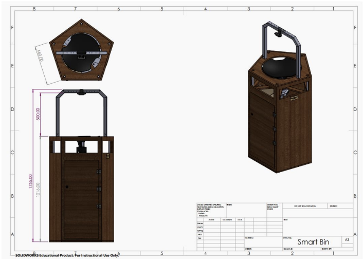
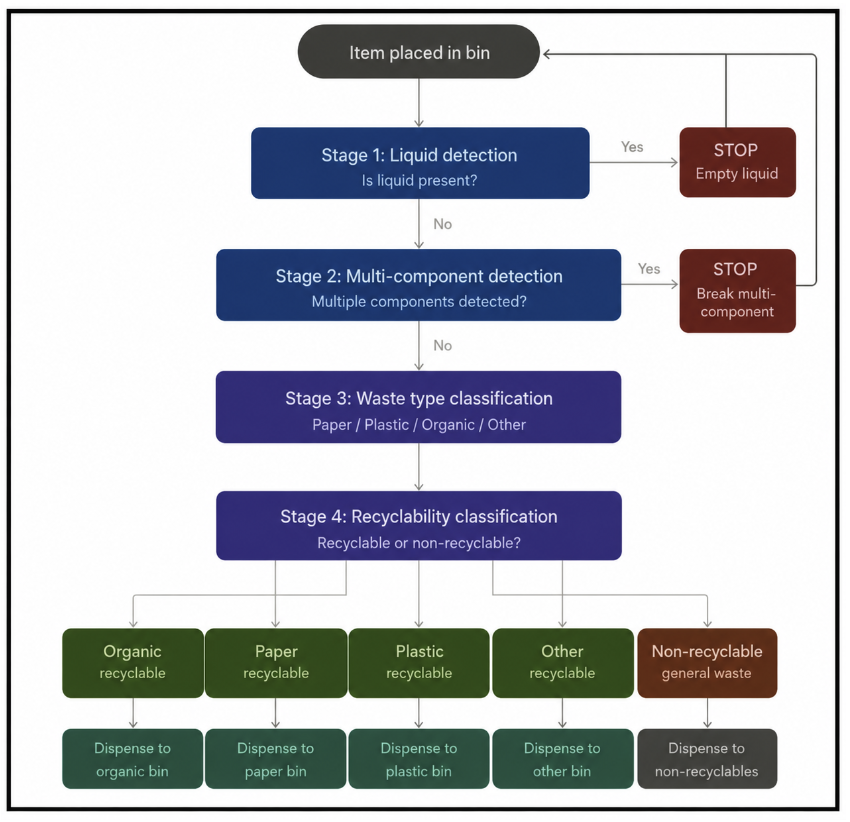

# 🗑️ SmartSort: Multi-Task Deep Learning System for Automated Waste Sorting

<p align="center">
  
</p>

<p align="center">
  <em>SmartSort physical smart bin prototype developed in collaboration with Nestlé, Dawar, AUC's Eltoukhy Learning Factory, and MakersGate.</em>
</p>

> A senior thesis project by **Omar Moustafa**, **Malak Elsayed**, & **Nour Kahky**  
> Department of Mathematics and Actuarial Science, The American University in Cairo  
> Advised by **Dr. Noha Youssef** · In collaboration with **Nestlé** and **Dawar**

---

## Overview

SmartSort is an end-to-end deep learning pipeline that automatically analyzes incoming waste from a single image and classifies it across four critical dimensions:

| Task | Model Architecture | Validation Accuracy |
|---|---|---|
| Liquid Detection | MobileNetV2 | 94.7% |
| Single vs. Multi-Component Detection | MobileNetV2 | 94.5% |
| Recyclable vs. Non-Recyclable Classification | DenseNet121 | 96.8% |
| Waste Material Classification | Xception | 94.3% |

The four independently trained CNN models are integrated into a **sequential decision pipeline** that mirrors real-world bin behavior. On an external real-world validation dataset provided by Dawar, the unified pipeline achieved **92.4% accuracy**.

This research was funded by Nestlé and Dawar, and culminated in a **physical smart bin prototype** built by AUC's Eltoukhy Learning Factory and MakersGate, integrating the deep learning pipeline with sensors, cameras, and embedded hardware for real-world deployment.

---

## Pipeline Architecture

<p align="center">
  
</p>

<p align="center">
  <em>Figure 1. Sequential multi-stage SmartSort waste classification pipeline.</em>
</p>

The pipeline processes each input image through three sequential stages:

```
Input Image
     │
     ▼
┌─────────────────────────┐
│  Stage 1: Liquid        │──► LIQUID DETECTED → "Please empty liquid" (Code 1)
│  Detection              │
└────────────┬────────────┘
             │ No liquid
             ▼
┌─────────────────────────┐
│  Stage 2: Component     │──► MULTI-COMPONENT → "Separate components" (Code 2)
│  Detection              │
└────────────┬────────────┘
             │ Single component
             ▼
┌─────────────────────────┐
│  Stage 3: Recyclable    │──► NON-RECYCLABLE → General waste bin (Code 7)
│  Classification         │
└────────────┬────────────┘
             │ Recyclable
             ▼
┌─────────────────────────┐    Code 3 → Plastic compartment
│  Stage 3b: Material     │    Code 4 → Paper compartment
│  Classification         │    Code 5 → Organic compartment
└─────────────────────────┘    Code 6 → Other recyclable compartment
```

**Decision Codes:**

| Code | Meaning | Action |
|------|---------|--------|
| 1 | Liquid detected | Prompt user to empty liquid |
| 2 | Multi-component item | Prompt user to separate components |
| 3 | Recyclable — Plastic | Dispense to plastic compartment |
| 4 | Recyclable — Paper | Dispense to paper compartment |
| 5 | Recyclable — Organic | Dispense to organic compartment |
| 6 | Recyclable — Other | Dispense to general recycling compartment |
| 7 | Non-recyclable | Dispense to general waste compartment |

---

## Repository Structure

```
smartsort/
│
├── images/
│   ├── system_architecture.png                # Pipeline architecture diagram
│   └── prototype_design.png                   # Physical smart bin prototype
│
├── models/                                    # ⚠️ Weights not included — see note below
│   ├── final_adjusted_liquid_advance.h5        # Liquid detection model (MobileNetV2)
│   ├── component_model_fixed_v3.h5             # Component detection model (MobileNetV2)
│   ├── DenseNet121_binary_v2.keras             # Recyclability classifier (DenseNet121)
│   └── xception_4classes.keras                # Material classifier (Xception)
│
├── notebooks/
│   └── smart_waste_bin_pipeline_may22.ipynb   # Unified inference pipeline (Google Colab)
│
├── requirements.txt                           # Full dependency list
└── README.md
```

> ⚠️ **Model weights are not included in this repository** due to file size constraints.
> To run the pipeline, you will need the following four files:
>
> - `final_adjusted_liquid_advance.h5`
> - `component_model_fixed_v3.h5`
> - `DenseNet121_binary_v2.keras`
> - `xception_4classes.keras`
>
> Contact the authors for access.

---

## Getting Started

### Prerequisites

- Python 3.9+
- TensorFlow 2.19.0
- Google Colab (recommended) or a local GPU environment

### Installation

```bash
pip install tensorflow==2.19.0 opencv-python-headless numpy pillow
```

Or install all dependencies from the full requirements file:

```bash
pip install -r requirements.txt
```

### Running the Pipeline

The main pipeline is contained in `notebooks/smart_waste_bin_pipeline_may22.ipynb`. It is designed to run in **Google Colab**.

1. Upload the notebook to Google Colab.
2. Upload all four model files to your Colab session (or mount Google Drive and update the model paths).
3. Run all cells to load the models.
4. When prompted, upload a waste image — the pipeline will run all four classification stages and return a decision code and action message.

```python
# Model paths — update these if needed
LIQUID_MODEL_PATH    = 'final_adjusted_liquid_advance.h5'
COMPONENT_MODEL_PATH = 'component_model_fixed_v3.h5'
BINARY_MODEL_PATH    = 'DenseNet121_binary_v2.keras'
CATEGORY_MODEL_PATH  = 'xception_4classes.keras'
```

### Example Output

```
============================================================
  PROCESSING: cola_bottle.jpeg
============================================================

🔍 Stage 1 · Liquid Detection
   raw=0.8231  →  ✅ No liquid  (82.3%)

🔍 Stage 2 · Component Detection
   raw=0.9104  →  ✅ Single component  (91.0%)

🔍 Stage 3 · Waste Classification
   ♻️  RECYCLABLE — PLASTIC  (97.2%)

============================================================
  🎯 DECISION CODE : 3
  📢 ACTION        : Dispensing to Plastic recyclable compartment
============================================================
```

---

## Models

### Liquid Detection — `final_adjusted_liquid_advance.h5`

- **Architecture:** MobileNetV2 (transfer learning)
- **Task:** Binary classification — liquid vs. non-liquid content
- **Input:** 224 × 224 RGB image
- **Threshold:** 0.5 (raw score < 0.5 → liquid detected)

### Component Detection — `component_model_fixed_v3.h5`

- **Architecture:** MobileNetV2 (transfer learning)
- **Task:** Binary classification — single vs. multi-component item (e.g., paper cup with plastic lid)
- **Input:** 224 × 224 RGB image
- **Threshold:** 0.5 (raw score < 0.5 → multi-component detected)

### Recyclability Classifier — `DenseNet121_binary_v2.keras`

- **Architecture:** DenseNet121 (transfer learning)
- **Task:** Binary classification — recyclable vs. non-recyclable
- **Input:** 224 × 224 RGB image, DenseNet preprocessing

### Material Classifier — `xception_4classes.keras`

- **Architecture:** Xception (transfer learning)
- **Task:** Multi-class classification — Paper, Plastic, Organic, or Other
- **Input:** 299 × 299 RGB image, Xception preprocessing
- **Only runs** if the recyclability model returns "recyclable"

---

## Dataset

No large-scale public dataset for multi-task waste classification existed at the time of this project. The team built a custom labeled dataset from scratch, covering the following waste categories:

`Automobile Wastes` · `Battery Waste` · `E-Waste` · `Glass Waste` · `Light Bulbs` · `Metal Waste` · `Paper Waste` · `Plastic Waste` · `Organic Waste`

These were mapped to the four output classes as follows:

| Raw Category | Pipeline Class |
|---|---|
| Paper waste | Paper |
| Plastic waste | Plastic |
| Organic waste | Organic |
| E-waste, automobile, battery, glass, light bulbs, metal | Other |

External real-world validation data was provided by **Dawar**, an Egyptian waste management company.

---

## Results

| Evaluation | Accuracy |
|---|---|
| Material Classification (validation) | 94.3% |
| Recyclability Classification (validation) | 96.8% |
| Liquid Detection (validation) | 94.7% |
| Component Detection (validation) | 94.5% |
| **Unified pipeline on external real-world data** | **92.4%** |

---

## Physical Prototype

<p align="center">
  
</p>

<p align="center">
  <em>Figure 2. Physical SmartSort prototype developed in collaboration with AUC's Eltoukhy Learning Factory and MakersGate.</em>
</p>

Beyond the software pipeline, this project was extended into a **real-world smart bin prototype** funded by Nestlé and Dawar, and fabricated by AUC's **Eltoukhy Learning Factory** and **MakersGate**. The prototype integrates:

- Camera module for image capture
- Embedded hardware running the deep learning pipeline
- Motorized compartments driven by the decision codes (1–7)
- Sensors for bin capacity and status monitoring

---

## Acknowledgements

This project would not have been possible without the support of:

- **Dr. Noha Youssef** — Thesis advisor, Department of Mathematics and Actuarial Science, AUC
- **Ms. Mahira Hassan** — Nestlé, for industry collaboration and funding
- **Mr. Amr Fathi & Mr. Youssef Sami** — Dawar, for real-world data and deployment partnership
- **AUC Eltoukhy Learning Factory & MakersGate** — Prototype design and fabrication

---

## License

This repository is shared for academic and research purposes.
